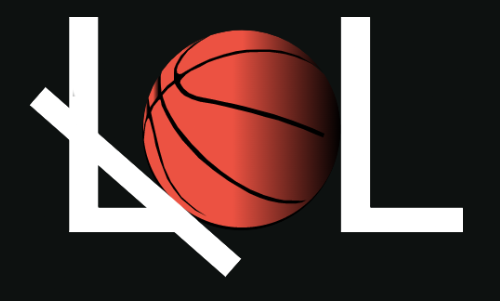

  
   

<!-- TABLE OF CONTENTS -->

# 📗 Table of Contents

- [📖 About the Project](#about-project)
  - [🛠 Built With](#built-with)
    - [Tech Stack](#tech-stack)
    - [Key Features](#key-features)
  - [🚀 Live Demo](#live-demo)
- [💻 Getting Started](#getting-started)
  - [Prerequisites](#prerequisites)
  - [Install](#install)
  - [Usage](#usage)
  - [Deployment](#triangular_flag_on_post-deployment)
- [👥 Authors](#authors)
- [🔭 Future Features](#future-features)
- [🤝 Contributing](#contributing)
- [⭐️ Show your support](#support)
- [🙏 Acknowledgements](#acknowledgements)
- [🙏 Credits](#credits)
- [📝 License](#license)

<!-- PROJECT DESCRIPTION -->

# 📖 <a name="about-project">LIL Draft 2023</a>

This project is a two-page website created with a defined [template](#credits). The project is based on a fake event. All people, names, cities, and venues were generated by free AI generators and/or by the project [author](#authors). Images used in the project are not licensed.

The project is built as a final project for the first module of Microverse (Capstone project).

## 🛠 Built With 

### Tech Stack 

  <ul>
    <li><a href="https://html.spec.whatwg.org/multipage/">HTML</a></li>
   <li><a href="https://www.w3.org/TR/CSS/#css">CSS</a></li>
   <li><a href="https://tailwindcss.com/">Tailwind</a></li>
   <li><a href="https://www.javascript.com/">JavaScript</a></li>
  </ul>

<!-- Features -->

### Key Features 

  <ul>
    <li>Responsiveness</li>
    <li>Best practice of HTML and CSS</li>
    <li>Best practice of JavaScript</li>
    <li>Dynamical elements</li>
    <li>High performance and accessibility</li>
  </ul>

(<a href="#readme-top">back to top</a>)

<!-- LIVE DEMO -->

## 🚀 Live Demo 

- [Online version of my project](https://romans-adi.github.io/)

(<a href="#readme-top">back to top</a>)

<!-- VIDEO PRESENTATION -->

## :video_camera: Video Presentation 

[Here](https://www.loom.com/share/55352cc9aa32486aae3865e8449b2701) you can see a short (5 min.) video presentation of the project.

(<a href="#readme-top">back to top</a>)

<!-- GETTING STARTED -->

## 💻 Getting Started 

To get a local copy up and running, follow these steps.

### Prerequisites

In order to run this project you need:

Clone the project using terminal on your local machine. After succefull cloning you can open it in any text editor of your choice.

### Setup

Choose the directory on your local machine where you want to copy project. For example:
  > cd /home/user/name-of-your-directory

Clone the project using one of the options.

Using SSH-key:
  > git clone git@github.com:romans-adi/romans-adi.github.io.git

Using HTTPS:
  > git clone https://github.com/romans-adi/romans-adi.github.io.git

You can also create the new directory just adding the name of it in the end of command. For example:
  > git clone https://github.com/romans-adi/romans-adi.github.io.git portfolio

### Usage

To run the project, execute the following command:

Linux:

 > xdg-open index.html

Windows:

> start index.html

MacOS:

> open index.html

Cygwin:

> cygstart index.html

### Deployment

This project was deployed using:

- [GitHub Pages](https://pages.github.com/)

(<a href="#readme-top">back to top</a>)

<!-- AUTHORS -->

## 👥 Authors 

👤 **Romans S.**

- GitHub: [@romans-adi](https://github.com/romans-adi/)
- Twitter: [@obj583](https://twitter.com/obj583/)
- LinkedIn: [Romans Špiļaks](https://www.linkedin.com/in/obj513/)

(<a href="#readme-top">back to top</a>)

<!-- Future Features -->

## :sunrise_over_mountains: Future Features 

- **Adding new pages and fresh content**
- **Connect website to the database to store players data**

(<a href="#readme-top">back to top</a>)

<!-- CONTRIBUTING -->

## 🤝 Contributing 

Contributors:

Contributions, issues, and feature requests are welcome!

Feel free to check the [issues page](../../issues/).

(<a href="#readme-top">back to top</a>)

<!-- SUPPORT -->

## ⭐️ Show your support 

To show your support, you can star this project. I would also appreciate any commentaries.
Additionally, you can contact me reaching me by any link mentioned in the section <a href="#authors">Authors</a>.

(<a href="#readme-top">back to top</a>)

<!-- ACKNOWLEDGEMENTS -->

## 🙏 Acknowledgments 

I would like to thank Microverse platform and my coding partners for useful tips and suggestions.

(<a href="#readme-top">back to top</a>)

<!-- CREDITS -->
## 🌱 Credits 

Original design idea by [Cindy Shin in Behance](https://www.behance.net/adagio07).

(<a href="#readme-top">back to top</a>)

<!-- LICENSE -->

## 📝 License 

This project is [MIT](./MIT.md) licensed.

(<a href="#readme-top">back to top</a>)

